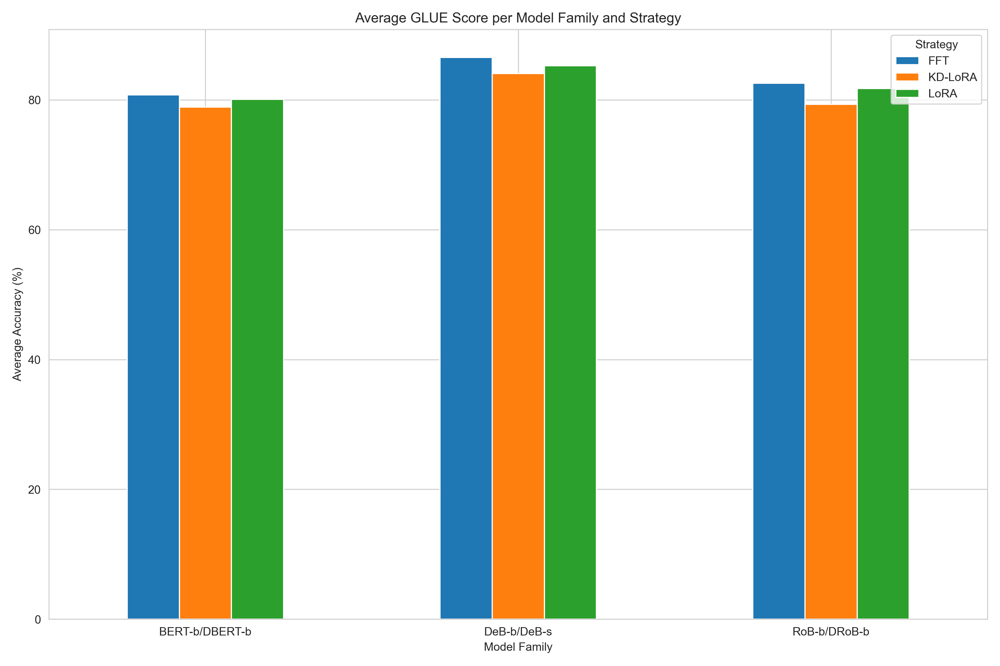
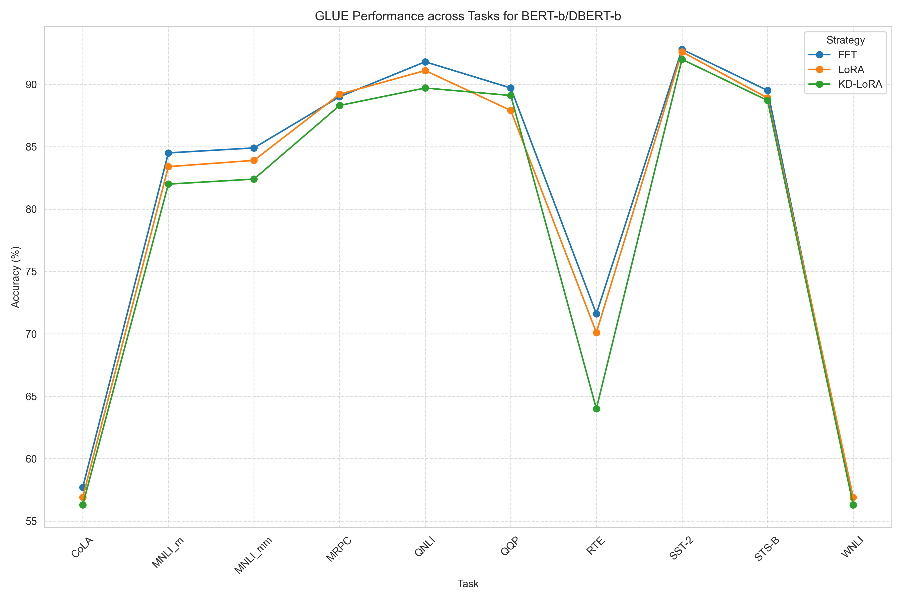
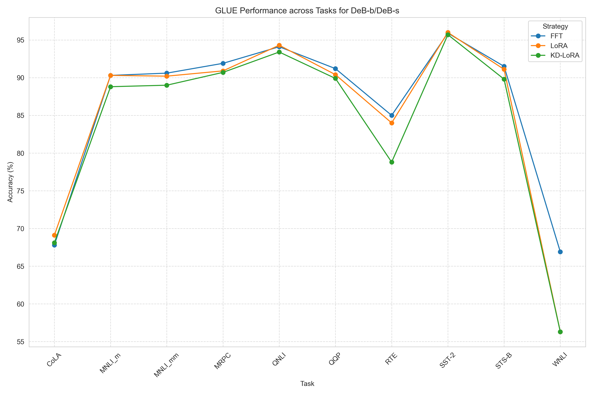
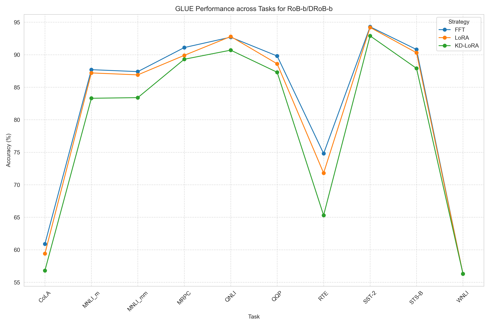

# KD-LoRA GLUE Performance Analysis

## Overview
Analysis of GLUE task performance for three model families (BERT-b/DBERT-b, DeB-b/DeB-s, RoB-b/DRoB-b) and three fine‑tuning strategies (FFT, LoRA, KD‑LoRA).

## Summary Statistics

### Average Scores per Model Family and Strategy

| Model_Family   | Strategy   |   Score |
|:---------------|:-----------|--------:|
| BERT-b/DBERT-b | FFT        |   80.78 |
| BERT-b/DBERT-b | KD-LoRA    |   78.88 |
| BERT-b/DBERT-b | LoRA       |   80.09 |
| DeB-b/DeB-s    | FFT        |   86.52 |
| DeB-b/DeB-s    | KD-LoRA    |   84.05 |
| DeB-b/DeB-s    | LoRA       |   85.26 |
| RoB-b/DRoB-b   | FFT        |   82.58 |
| RoB-b/DRoB-b   | KD-LoRA    |   79.32 |
| RoB-b/DRoB-b   | LoRA       |   81.74 |

### Overall Averages (Provided Score Row)

|                        |   Score |
|:-----------------------|--------:|
| BERT-b/DBERT-b FFT     |    80.8 |
| BERT-b/DBERT-b LoRA    |    80.1 |
| BERT-b/DBERT-b KD-LoRA |    78.9 |
| DeB-b/DeB-s FFT        |    86.5 |
| DeB-b/DeB-s LoRA       |    85.3 |
| DeB-b/DeB-s KD-LoRA    |    84.1 |
| RoB-b/DRoB-b FFT       |    82.6 |
| RoB-b/DRoB-b LoRA      |    81.7 |
| RoB-b/DRoB-b KD-LoRA   |    79.3 |

## Performance Drops

### Average Drops Across All Tasks

| Comparison     |   Mean Drop (pp) |   Std Dev |
|:---------------|-----------------:|----------:|
| FFT → LoRA     |          0.93    |   1.96336 |
| FFT → KD‑LoRA  |          2.54333 |   2.66604 |
| LoRA → KD‑LoRA |          1.61333 |   1.76687 |

## Key Findings

1. **Best model family**: DeB-b/DeB-s (average across strategies: 85.3%)
2. **Best strategy**: FFT (average across models: 83.3%)
3. **Average performance drop from FFT to KD‑LoRA**: 2.54 percentage points
4. **Most robust tasks to distillation** (smallest drop from FFT to KD‑LoRA):
   - SST-2: 0.80% drop
   - MRPC: 1.23% drop
   - QQP: 1.47% drop
5. **Most sensitive tasks to distillation** (largest drop from FFT to KD‑LoRA):
   - RTE: 7.77% drop
   - WNLI: 3.53% drop
   - MNLI_m: 2.80% drop
6. **Tasks where LoRA underperforms FFT by >2%**:
   - DeB-b/DeB-s: WNLI
   - RoB-b/DRoB-b: RTE
7. **Surprising results (KD‑LoRA outperforms LoRA)**:
   - BERT-b/DBERT-b: QQP
8. **Surprising results (KD‑LoRA outperforms FFT)**:
   - DeB-b/DeB-s: CoLA

## Visualizations

### Bar Chart: Average GLUE Score per Model Family and Strategy

### Heatmaps: Performance Across Tasks and Strategies

#### BERT-b/DBERT-b

#### DeB-b/DeB-s

#### RoB-b/DRoB-b

### Line Plots: Performance Trends Across Tasks

#### BERT-b/DBERT-b

#### DeB-b/DeB-s

#### RoB-b/DRoB-b

## Detailed Performance Drops by Task

Positive values indicate first strategy outperforms second.

| Task    |   BERT-b/DBERT-b_FFT_to_LoRA |   BERT-b/DBERT-b_FFT_to_KD_LoRA |   BERT-b/DBERT-b_LoRA_to_KD_LoRA |   DeB-b/DeB-s_FFT_to_LoRA |   DeB-b/DeB-s_FFT_to_KD_LoRA |   DeB-b/DeB-s_LoRA_to_KD_LoRA |   RoB-b/DRoB-b_FFT_to_LoRA |   RoB-b/DRoB-b_FFT_to_KD_LoRA |   RoB-b/DRoB-b_LoRA_to_KD_LoRA |
|:--------|-----------------------------:|--------------------------------:|---------------------------------:|--------------------------:|-----------------------------:|------------------------------:|---------------------------:|------------------------------:|-------------------------------:|
| CoLA    |                          0.8 |                             1.4 |                              0.6 |                      -1.3 |                         -0.3 |                           1   |                        1.5 |                           4.1 |                            2.6 |
| MNLI_m  |                          1.1 |                             2.5 |                              1.4 |                       0   |                          1.5 |                           1.5 |                        0.5 |                           4.4 |                            3.9 |
| MNLI_mm |                          1   |                             2.5 |                              1.5 |                       0.4 |                          1.6 |                           1.2 |                        0.5 |                           4   |                            3.5 |
| MRPC    |                         -0.2 |                             0.7 |                              0.9 |                       1   |                          1.2 |                           0.2 |                        1.2 |                           1.8 |                            0.6 |
| QNLI    |                          0.7 |                             2.1 |                              1.4 |                      -0.2 |                          0.7 |                           0.9 |                       -0.1 |                           2   |                            2.1 |
| QQP     |                          1.8 |                             0.6 |                             -1.2 |                       0.8 |                          1.3 |                           0.5 |                        1.2 |                           2.5 |                            1.3 |
| RTE     |                          1.5 |                             7.6 |                              6.1 |                       1   |                          6.2 |                           5.2 |                        3   |                           9.5 |                            6.5 |
| SST-2   |                          0.2 |                             0.8 |                              0.6 |                      -0.1 |                          0.2 |                           0.3 |                        0.1 |                           1.4 |                            1.3 |
| STS-B   |                          0.6 |                             0.8 |                              0.2 |                       0.4 |                          1.7 |                           1.3 |                        0.5 |                           2.9 |                            2.4 |
| WNLI    |                         -0.6 |                             0   |                              0.6 |                      10.6 |                         10.6 |                           0   |                        0   |                           0   |                            0   |

## Appendix: Raw Data

First few rows of the loaded table:

| Task    |   BERT-b/DBERT-b FFT |   BERT-b/DBERT-b LoRA |   BERT-b/DBERT-b KD-LoRA |   DeB-b/DeB-s FFT |   DeB-b/DeB-s LoRA |   DeB-b/DeB-s KD-LoRA |   RoB-b/DRoB-b FFT |   RoB-b/DRoB-b LoRA |   RoB-b/DRoB-b KD-LoRA |
|:--------|---------------------:|----------------------:|-------------------------:|------------------:|-------------------:|----------------------:|-------------------:|--------------------:|-----------------------:|
| CoLA    |                 57.7 |                  56.9 |                     56.3 |              67.8 |               69.1 |                  68.1 |               60.9 |                59.4 |                   56.8 |
| MNLI_m  |                 84.5 |                  83.4 |                     82   |              90.3 |               90.3 |                  88.8 |               87.7 |                87.2 |                   83.3 |
| MNLI_mm |                 84.9 |                  83.9 |                     82.4 |              90.6 |               90.2 |                  89   |               87.4 |                86.9 |                   83.4 |
| MRPC    |                 89   |                  89.2 |                     88.3 |              91.9 |               90.9 |                  90.7 |               91.1 |                89.9 |                   89.3 |
| QNLI    |                 91.8 |                  91.1 |                     89.7 |              94.1 |               94.3 |                  93.4 |               92.7 |                92.8 |                   90.7 |

---
*Analysis generated on 2026-01-28 09:11*