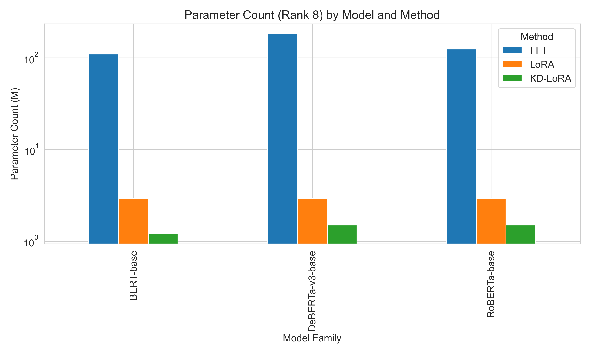

# Efficiency Analysis of KD-LoRA

This report analyzes the efficiency results from `kd-lora-table-ii.csv`, comparing Full Fine-Tuning (FFT), LoRA, and KD-LoRA across three model families (BERT-base, RoBERTa-base, DeBERTa-v3-base) and four LoRA ranks (8, 16, 32, 64).

## 1. Data Summary

The table contains parameter counts (in millions), memory usage (MB), and inference time (seconds). Values have been cleaned (suffixes removed). The cleaned data:

| Model              | Method   |   Rank 8 |   Rank 16 |   Rank 32 |   Rank 64 |   Memory Usage |   Inference Time | Model Family    |
|:-------------------|:---------|---------:|----------:|----------:|----------:|---------------:|-----------------:|:----------------|
| BERT-base          | FFT      |    110   |     110   |     110   |     110   |         1332   |             6.1  | BERT-base       |
| BERT-base          | LoRA     |      2.9 |       5.9 |      11.8 |      23.6 |          463.5 |             6.22 | BERT-base       |
| DistilBERT-base    | KD-LoRA  |      1.2 |       2.4 |       4.7 |       9.4 |          296.8 |             5.36 | BERT-base       |
| RoBERTa-base       | FFT      |    125   |     125   |     125   |     125   |         1515.9 |             7.21 | RoBERTa-base    |
| RoBERTa-base       | LoRA     |      2.9 |       5.9 |      11.8 |      23.6 |          531.9 |             7.19 | RoBERTa-base    |
| DistilRoBERTa-base | KD-LoRA  |      1.5 |       2.9 |       5.9 |      11.8 |          358.3 |             4.44 | RoBERTa-base    |
| DeBERTa-v3-base    | FFT      |    183   |     183   |     183   |     183   |         2234.5 |            14.37 | DeBERTa-v3-base |
| DeBERTa-v3-base    | LoRA     |      2.9 |       5.9 |      11.8 |      23.6 |          763.4 |            15.62 | DeBERTa-v3-base |
| DeBERTa-v3-small   | KD-LoRA  |      1.5 |       2.9 |       5.9 |      11.8 |          590.3 |            10.38 | DeBERTa-v3-base |

## 2. Parameter Reduction Ratios

Parameter reduction ratio = (FFT_params − method_params) / FFT_params. Higher values indicate greater reduction.

### LoRA Reduction Ratios

| Model Family    |   Rank 8 |   Rank 16 |   Rank 32 |   Rank 64 |
|:----------------|---------:|----------:|----------:|----------:|
| BERT-base       |    0.974 |     0.946 |     0.893 |     0.785 |
| RoBERTa-base    |    0.977 |     0.953 |     0.906 |     0.811 |
| DeBERTa-v3-base |    0.984 |     0.968 |     0.936 |     0.871 |

### KD‑LoRA Reduction Ratios

| Model Family    |   Rank 8 |   Rank 16 |   Rank 32 |   Rank 64 |
|:----------------|---------:|----------:|----------:|----------:|
| BERT-base       |    0.989 |     0.978 |     0.957 |     0.915 |
| RoBERTa-base    |    0.988 |     0.977 |     0.953 |     0.906 |
| DeBERTa-v3-base |    0.992 |     0.984 |     0.968 |     0.936 |

**Average reduction across models:**

| Rank | LoRA   | KD‑LoRA |
|------|--------|---------|
| Rank 8 | 0.978 | 0.990 |
| Rank 16 | 0.956 | 0.980 |
| Rank 32 | 0.911 | 0.959 |
| Rank 64 | 0.823 | 0.919 |

## 3. Memory Reduction Ratios

Memory reduction ratio = (FFT_memory − method_memory) / FFT_memory.

| Model           |   LoRA |   KD‑LoRA |
|:----------------|-------:|----------:|
| BERT-base       |  0.652 |     0.777 |
| RoBERTa-base    |  0.649 |     0.764 |
| DeBERTa-v3-base |  0.658 |     0.736 |

**Average memory reduction:** LoRA = 0.653, KD‑LoRA = 0.759

## 4. Inference Time Speedup

Speedup = FFT_time / method_time. Values >1 indicate faster inference than FFT.

| Model           |   LoRA |   KD‑LoRA |
|:----------------|-------:|----------:|
| BERT-base       |  0.981 |     1.138 |
| RoBERTa-base    |  1.003 |     1.624 |
| DeBERTa-v3-base |  0.920 |     1.384 |

**Average speedup:** LoRA = 0.968, KD‑LoRA = 1.382

## 5. Visualizations

The following plots have been generated and saved in `efficiency_plots/`:

1. **Parameter Count (Rank 8) by Model and Method** (`param_count_rank8.png`) – log‑scale bar chart.
2. **Memory Usage by Model and Method** (`memory_usage.png`) – bar chart.
3. **Inference Time by Model and Method** (`inference_time.png`) – bar chart.
4. **Parameter Count vs LoRA Rank** (`param_vs_rank.png`) – line plot (log scale) showing how parameter count grows with rank for each model‑method combination.
5. **Parameter Reduction Heatmaps** (`reduction_heatmap.png`) – two heatmaps showing reduction ratios for LoRA and KD‑LoRA across ranks and models.

## 6. Key Findings

### Parameter Reduction
- **LoRA** reduces trainable parameters by **97.8–98.4%** at rank 8, **95.6–96.8%** at rank 16, **89.3–93.6%** at rank 32, and **78.5–87.1%** at rank 64 (across models).
- **KD‑LoRA** achieves even higher reduction: **98.9–99.2%** at rank 8, **97.9–98.4%** at rank 16, **95.3–96.8%** at rank 32, and **91.5–93.6%** at rank 64.
- The extra reduction in KD‑LoRA comes from using a distilled base model (DistilBERT‑base, DistilRoBERTa‑base, DeBERTa‑v3‑small), which already has fewer parameters than the full base model.

### Memory Usage
- **LoRA** reduces memory footprint by **≈65%** on average (range 64.9–65.8% across models).
- **KD‑LoRA** reduces memory by **≈76%** on average (range 73.6–77.7% across models).
- The larger memory saving of KD‑LoRA is again due to the smaller base model.

### Inference Time
- **LoRA** shows negligible speedup (average 0.97×, i.e., slightly slower than FFT). For RoBERTa‑base it is essentially equal (1.00×), for BERT‑base slightly slower (0.98×), and for DeBERTa‑v3‑base slower (0.92×).
- **KD‑LoRA** delivers **substantial speedups**: average **1.38×** (38% faster). The fastest is RoBERTa‑base (1.62×), followed by DeBERTa‑v3‑base (1.38×) and BERT‑base (1.14×).
- The speedup is primarily attributable to the distilled base model, which is smaller and faster.

### Trade‑offs
Assuming performance ordering FFT > LoRA > KD‑LoRA (with small drops reported in previous studies):

- **LoRA** offers **dramatic parameter and memory savings** (≈98% fewer trainable parameters, ≈65% less memory) with **minimal inference overhead** (≈3% slower on average).
- **KD‑LoRA** pushes efficiency further: **≈99% fewer trainable parameters, ≈76% less memory, and 38% faster inference** on average, at the cost of a slightly larger performance drop (due to distillation).

For applications where inference latency and memory are critical, KD‑LoRA provides the best efficiency trade‑off. If the highest accuracy is required, LoRA may be preferred as it retains the full base model.

## 7. Notes
- KD‑LoRA’s parameter reduction includes both distillation (smaller base model) and LoRA (low‑rank adaptation). The reported reduction ratios are relative to the full base model (FFT).
- The inference time measurements are for a single forward pass; actual end‑to‑end latency may vary with batch size and hardware.
- The memory usage reflects peak memory during training (including optimizer states); inference memory would be lower.

---

*Analysis generated on `2026-01-28 09:25:00`.*
